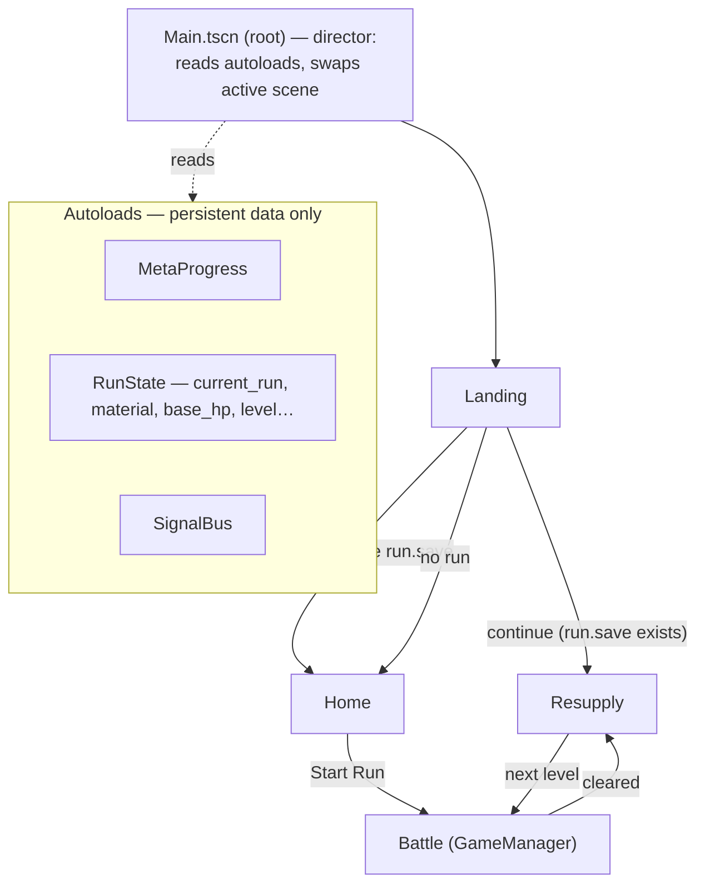
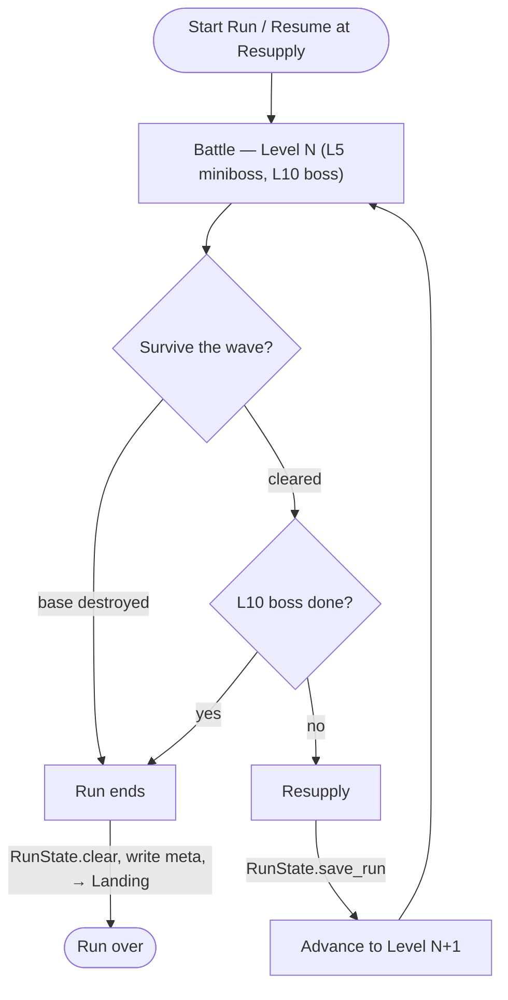
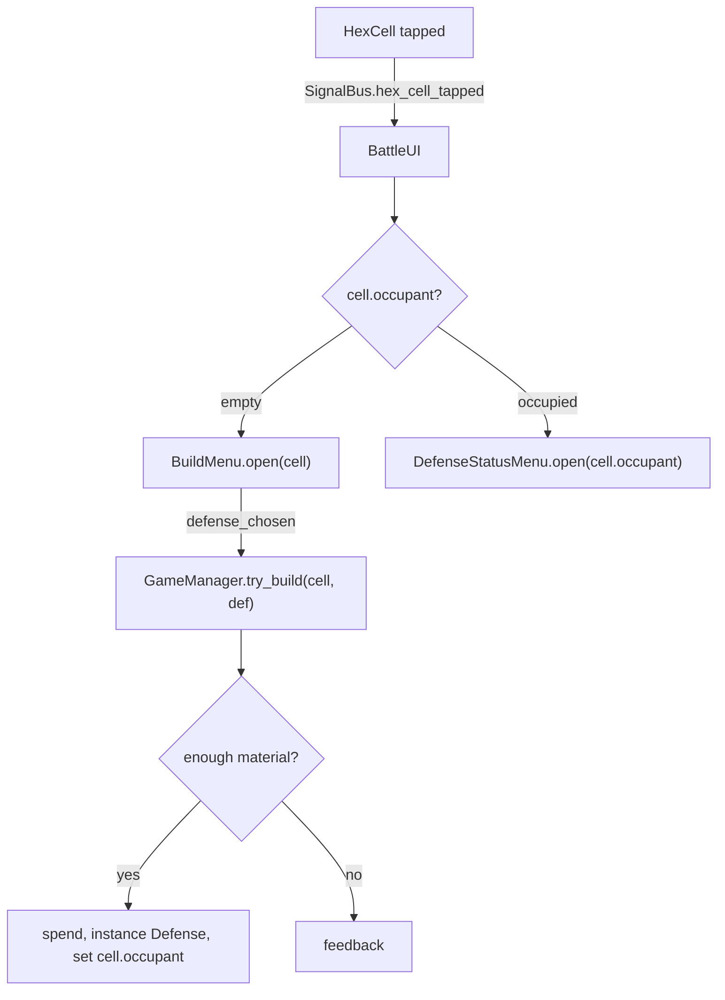
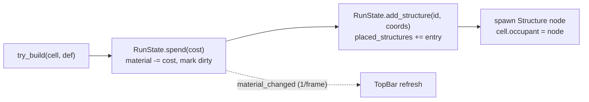

# ORBITAL — Architecture

Companion to [DESIGN.md](DESIGN.md). Scenes, the global layer (autoloads), run flow, the battle-phase breakdown, and saving. Deep subsystems (tech tree internals, powers slot/bag, gamba, curses, economy curve) are single boxes here.

> **Status:** proposed, evolving. Open decisions at the bottom.

---

## Two progression layers

| Layer | Where | Lifetime | Examples |
|---|---|---|---|
| **Meta** | Home base | Permanent, across all runs — **saved to disk** | Out-of-game progression trees, meta points, unlocks, run history/high scores |
| **In-run** | Resupply phase | One run only — wiped when the run ends | Tech tree, powers panel + bag, gamba, curses |

---

## 1. Scenes & autoloads

A thin **root director** (`Main.tscn`, the main scene) decides what's on screen: it reads the autoloads and swaps the **active child scene** (Landing → Home / Resupply / Battle). It stays loaded the whole time; only its child swaps. Autoloads are **data only** — they persist across swaps, they don't drive flow.

| Autoload | Holds |
|---|---|
| `MetaProgress` | Permanent cross-run data: unlocks, meta points, run history/high scores. Owns `meta.save`. |
| `RunState` | The live current run: `current_run` flag, material, base_hp, level, tech, powers, curses. Owns `run.save`; `start_run()` seeds from `MetaProgress`. |
| `SignalBus` | **Declares** cross-cutting signals. No logic — a relay only. |

The root director replaces the need for a `SceneManager` autoload. `GameManager` is **not** an autoload — it's inside `Battle.tscn`, battle-only.

---

## 2. Run flow

~10 levels, miniboss at L5, boss at L10. Material + base HP carry between levels (held on `RunState`). Launch routing lives in §1 (director → Landing); this is the per-run loop once a battle starts.

---

## 3. Battle-phase architecture

Nodes inside `Battle.tscn` and who owns what:

| Node | Responsible for |
|---|---|
| `GameManager` | Wave timing (drives spawner), win/loss, scene transition, `try_build(cell, def)` (check → spend → place). Modifies `RunState`. |
| `WaveSpawner` | Spawns enemies on cue (keeps GameManager lean; optional for v1). Samples `SpawnArea` for spawn points. |
| `SpawnArea` (Area2D) | Top spawn band; the spawner picks a random x along its width. |
| `Enemy` (Area2D) | Reads `EnemyDef`; travels in a straight line toward the Base. Moved by setting `position` (no physics body). Own collision layer — enemies pass through each other and stack; only projectiles hit-test them. Group `enemies`. |
| `Base` (Marker2D) | The hull; `take_damage()` → `RunState.damage_base`. The point enemies aim at. Group `base`. |
| `HexGrid` | Builds cells; computes each cell's neighbors once (adjacency). |
| `HexCell` | `occupant`, `neighbors`, highlight; emits tap. |
| `Structure` | Reads its `StructureDef` + neighbor occupants (aura combos); acquires a target, fires a projectile in that direction. |
| `Projectile` (Area2D) | Launched with a direction + damage; flies straight, damages the first enemy it overlaps, despawns off-screen. No homing — dumb fire-and-forget. |
| `BattleUI` (CanvasLayer) | Owns the menus; opens the right one on tap; forwards build choice to `GameManager`. |
| `TopBar` | Displays `RunState` data (material, base_hp). |

**Signal routing — three buckets:**
- **SignalBus** (cross-cutting / many emitters): `hex_cell_tapped(cell)`, `enemy_died(enemy)`, `request_open_tech_tree`.
- **Autoload signals** (state changes): `RunState.material_changed`, `base_hp_changed` → `TopBar` connects directly.
- **Direct child→owner**: `BuildMenu.defense_chosen(def)` → its owner (`BattleUI`).

Rule: bus for cross-cutting, direct for owned, autoload-signals for state. Don't route everything through the bus, and keep **no logic in the bus**.

**Build flow (Pattern A — tap hex → menu, no pause):**

The occupied case **injects** the occupant into the status menu (`open(cell.occupant)`) — the menu displays what it's handed; the occupant never travels through the bus.

**Build flow — data trail** (where a placement's data goes):

Three stores, **two persist**: `RunState.material` and `RunState.placed_structures` are saved; `cell.occupant` + the spawned node are **runtime only**, rebuilt from `placed_structures` on load. `cell.occupant` is the live `Structure` node on a cell (or `null`) — used for empty/occupied checks, blocking double-placement, adjacency lookups, and the status-menu target. (If mass deaths ever storm the UI, coalesce `material_changed` to once per frame — deferred for now.)

**Pause:**
- Live (no pause): `BuildMenu`, `DefenseStatusMenu`.
- Pause (`get_tree().paused = true`): `TechTree`, `PauseMenu`, `DevTools`. Their root uses `process_mode = PROCESS_MODE_WHEN_PAUSED` so they stay interactive while gameplay freezes.

**Targeting at scale:**
- Now (hundreds): each defense uses an **Area2D detection radius** and keeps its target until it dies/leaves — no per-frame full scan.
- At ~1000 concurrent: a **uniform spatial grid (spatial hash)** rebuilt each frame; defenses query only the buckets in range. Pair with **data-oriented enemies** (state in arrays, one movement loop) and **MultiMeshInstance2D** rendering. Migrate when a profiled wave drops frames; keep each enemy's surface tiny (`position`, `take_damage()`, `id`) so the swap is contained.

---

## 4. Saving (local, single-player)

### Single source of truth
`RunState` is the **single source of truth** for the run; live nodes are just a *view* of it. That's what makes saving work — you can't serialize nodes, but you can serialize their data.

- **Store ids + primitives, never live nodes or `Resource` objects.** Placed defenses → `[{ def_id, coords:[x,y], level }]`; tech → `[node_id, …]`; resources → numbers; powers/curses → ids.
- Defenses reference a `StructureDef` by a stable **`id`** (add an `id` field, or use its `res://` path); a registry resolves `id → StructureDef` on load.
- **Write through methods, not raw fields** — `spend(cost)`, `add_structure(def_id, coords)`, `purchase_tech(id)` — so each write validates and fires a change signal.
- **The board renders `RunState`.** "Place a defense" and "load a save" share one path: append to `placed_structures` + spawn the node (needs `HexGrid.get_cell(coords)`). The `Structure` node is never the truth.

### When & where
Save **only at Resupply** — never mid-battle, never on pause. Quitting mid-wave loses that wave; resume at the last Resupply.

Two files in `user://`, each owned by its autoload:
- **`run.save`** — `RunState.save_run()` on reaching Resupply; `RunState.clear()` deletes it on run end.
- **`meta.save`** — `MetaProgress.save_meta()` when meta changes / on run end.

**Resume:** launch → `MetaProgress.load_meta()`; the director checks for `run.save` → Landing offers Continue (`RunState.load_run()` → Resupply) / Abandon (delete → Home); none → Home.

**Warm vs cold:** a quick iOS tab-out keeps the app in memory — you resume exactly where you were, **mid-fight included**, no reload. Landing-at-Resupply only applies to a **cold load from disk** (full close), where in-memory state is gone and `run.save` (last written at Resupply) is the recovery point.

Format: `RunState.to_dict()` → `JSON.stringify` → `FileAccess` → `run.save`; load reverses it into `from_dict()`. JSON has no `Vector2`/`Color` — store coords as `[x, y]` arrays (or `store_var`/`get_var` for binary).

Online: none for now. A future high-score / daily-challenge service would be a thin optional layer; it doesn't change this.

---

## Open decisions

1. **Spawning:** dedicated `WaveSpawner` node vs. `GameManager` doing it directly (v1).
2. **Director naming:** `Main` vs `Game` (avoid clashing with `GameManager`).
3. **Targeting migration:** when to move enemies data-oriented (profiler-driven).
4. **Meta tree scope:** size/shape of the home-base progression — TBD.
5. **`StructureDef` id scheme:** explicit `id` field vs `res://` path for save references.
