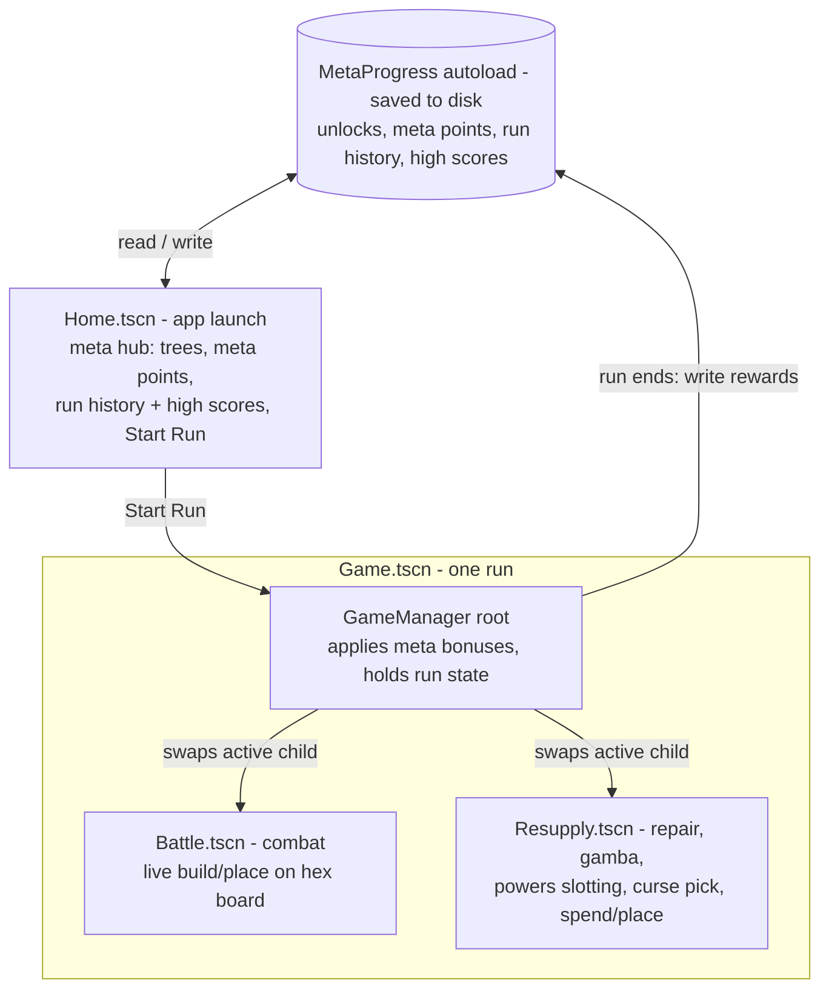
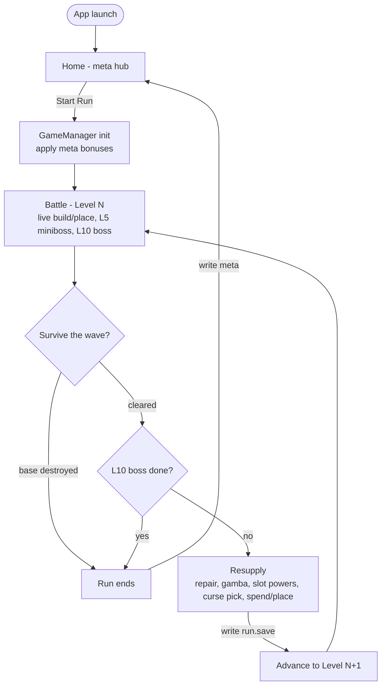

# ORBITAL — Architecture

Companion to [DESIGN.md](DESIGN.md). This is the **high-level** structure only — major scenes, the global layer, and the run flow. Deep subsystems (tech tree internals, powers slot/bag rules, gamba, curses, economy curve) are single boxes here and get their own designs later.

> **Status:** proposed, evolving. Open decisions at the bottom.

---

## Two progression layers

| Layer | Where | Lifetime | Examples |
|---|---|---|---|
| **Meta** | Home base | Permanent, across all runs — **saved to disk** | Out-of-game progression trees, meta points, unlocks, run history/high scores |
| **In-run** | Resupply phase | One run only — wiped when the run ends | Tech tree, powers panel + bag, gamba, curses |

---

## 1. Scene structure

You launch into **Home**. It's the meta hub: progression trees, meta points, run history, high scores, Start Run. Starting a run loads **Game**, whose root is a **GameManager** that applies your meta bonuses, holds the run state, and swaps its active child between **Battle** and **Resupply**.

---

## Autoloads
| Autoload | Needed? | Holds |
|---|---|---|
| `MetaProgress` | **Yes** | Cross-run unlocks + meta points; saved to disk. The one thing that *must* be global. |
| `SceneManager` | Optional | Home ↔ Run transitions / fades. Could also just live in Home/GameManager. |
| `Events` | Later, maybe | Global signal bus, if cross-system reactions get unwieldy. |

---

## 2. Run flow

~10 levels, miniboss at L5, boss at L10, currency carried between levels. Win or lose, the run returns to Home and writes any meta rewards.

---

## 3. Saving (local, single-player)

Save **only at Resupply** — never mid-battle, never on pause. Quitting mid-wave loses that wave; resume at the last Resupply (Slay-the-Spire-style).

Two files in `user://`:
- **`run.save`** — run snapshot, (re)written on reaching Resupply. Deleted when the run ends.
- **`meta.save`** — MetaProgress; written when meta changes (Home) and on run end.

**Resume:** on launch, `run.save` exists → re-enter at that Resupply; else → Home.

Format: JSON via `FileAccess` + `JSON.stringify`/`parse_string`. JSON has no `Vector2`/`Color` — convert manually, or use `store_var`/`get_var`.

---

## Open decisions

1. **Run state location:** start on `GameManager`; promote to a `RunState` autoload only if many nested nodes need global access.
2. **Battle config:** `GameManager` injects it vs Battle reads shared state.
3. **Transitions:** `SceneManager` autoload vs handled in Home/GameManager.
4. **Meta tree scope:** size/shape of the home-base progression — TBD.
